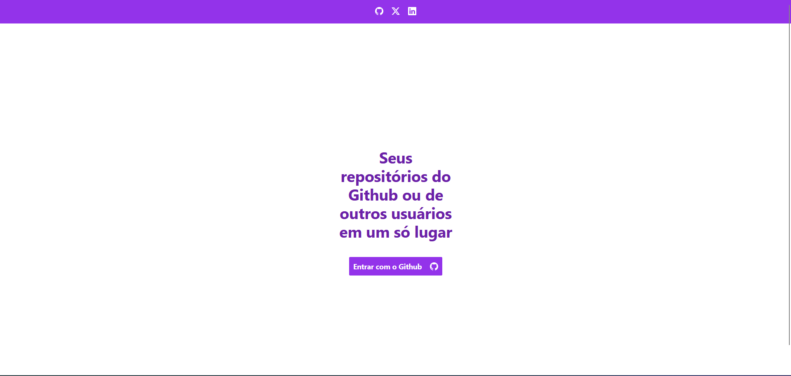
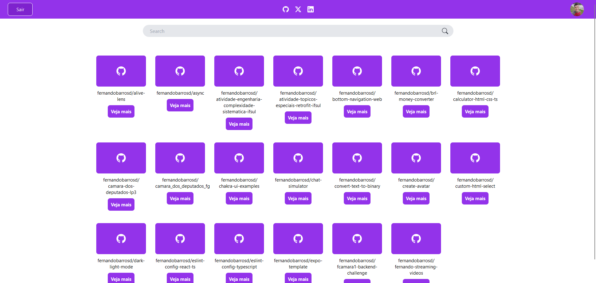
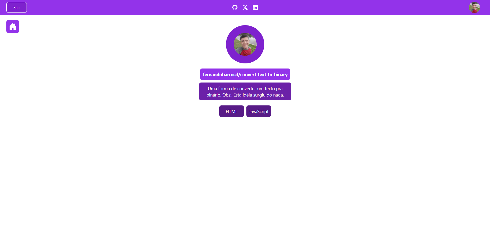

# Your Github Repos

Um local onde voce poderá pesquisar mais sobre os repositórios seus ou de outras pessoas.

## Por que foi criado?
Pra ter um local onde você poderá ver os repositórios seus ou de outras pessoas sem ter que estar no Github.

## Telas

- Boas vindas

 
 

- Inicio

 
 

- Informações do repositório

## Tecnlogias usadas

- HTML
- CSS
- Typescript
- Next JS
- TailwindCSS

## Contribuição

Para poder contribuir o projeto primeiro voce deverá seguir os seguintes passos:
- Ter o Node JS instalado. (https://nodejs.org/en)
- Efetuar o clone ou o fork do projeto no Github.

Clone: git clone https://github.com/fernandobarrosd/your-github-repos.git

## Como acessar?

Para poder acessar primeiro você deverá efetuar o login com o Github.

Link: https://your-github-repos.vercel.app/
